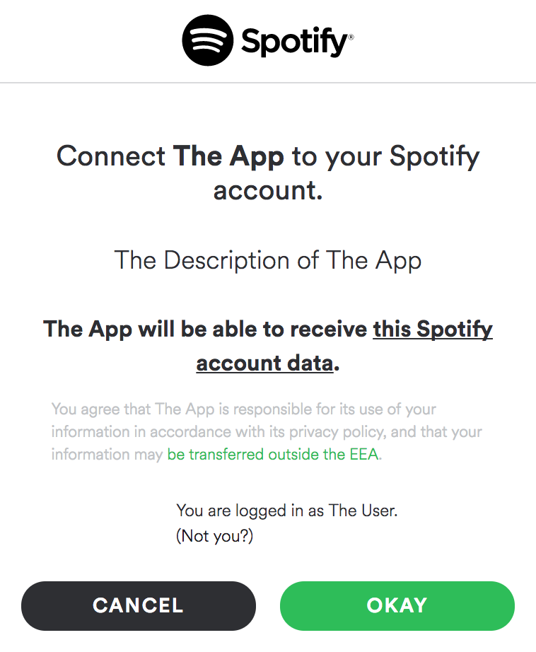
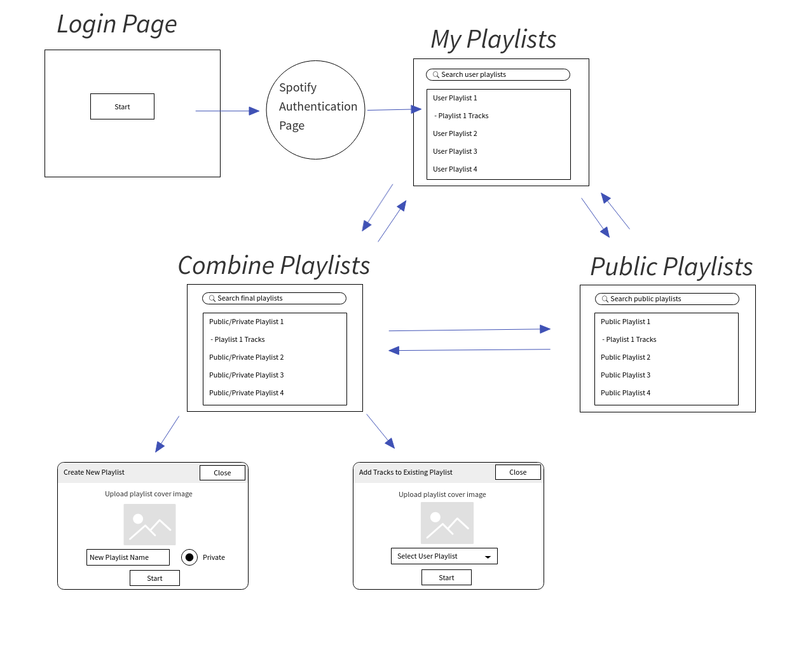
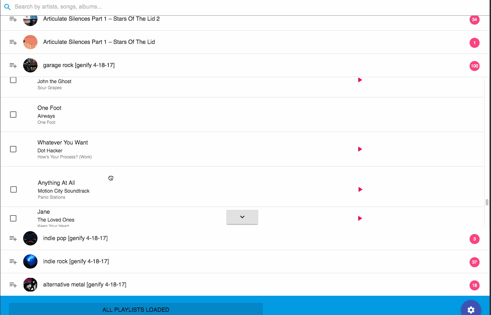

This is the first somewhat serious web application that I wrote in React. It took me a little while to come up with the app name. I was googling things and found out about the Latin word "Compono" [which translates as "to arrange, compile, organize, or compose"](https://www.wordsense.eu/compono/) while the ending "fy" is oftentimes attached to applications that use [Spotify APIs](https://developer.spotify.com/documentation/web-api/), so it started making sense for me to name the app [_Componofy_](https://componofy.herokuapp.com/). Turns out the name of the app implies its purpose - help Spotify users combine tracks from different playlists and then either 1) create a new playlist, or 2) merge these tracks with the existing playlist. In a way we are combining playlists together, except that it's not necessary to add all tracks from a specific playlist.

#### Backend

The backend side of it is written in Node.js using the server framework called [Hapi](https://hapi.dev/). To make my life a little easier while making calls to Spotify API I used the [Node wrapper for the Spotify API](https://github.com/thelinmichael/spotify-web-api-node).

In order to get access to user's personal playlists we have to authenticate the user first. After the user clicks on the button **Start**, the user is redirected to the authorization URL generated by Spotify API method [`createAuthorizeURL`](http://michaelthelin.se/spotify-web-api-node/#createAuthorizeURL). This function requires an argument that contains the list of permissions we want to ask from the Spotify user. We can control what type of permissions we want to ask from the user by specifying _scopes_:

```js
const permissionScopes = [
  'playlist-read-private',
  'playlist-read-collaborative',
  'playlist-modify-public',
  'playlist-modify-private',
];

SpotifyAPI.createAuthorizeURL(permissionScopes, 'spotify-auth');
```

Each permission gives the developer access to perform a related set of API calls that supply the app with access to user's Spotify data such as personal playlists, access to modifying personal playlists including re-ordering playlist tracks as well as an ability to add cover images for personal playlists. So, the generated url returned by `createAuthorizeURL` contains Spotify authentication page that asks the user for the specified permissions - this authentication page is shown to first-time users only. The following screen then should appear when the user is redirected:



Once the user agrees with the terms to allow developer have access to certain types of Spotify data, the user is then redirected to the main page of Componofy. After user authentication completes successfully, we get an access token used to make consequent Spotify API calls while the authenticated user is using the app. To keep track of the current user information, the token and some of user info is stored in a session object, which maintains the values of the access token for the session period until the user decides to log out. The token is refreshed periodically until the user logs out.

#### Frontend

The frontend side of the application is written in [React](https://reactjs.org/), a JavaScript library that gives developer necessary tools to build web applications in a functional and declarative way. Also, I installed various React packages to achieve crucial goals like routing between pages, dragging and dropping list items to re-order personal playlist tracks, and UI themed components. I went with one of the most popular UI themed components out there, the [Material UI library](https://material-ui.com/). Material UI helped me focus more on the main functionalities of the app rather than spending a lot of time on writing custom CSS. It significantly reduced the total development time. If you are working on side projects, I highly recommend you to check out some of [the most popular React UI libraries out there](https://blog.logrocket.com/top-10-react-component-libraries-for-2020/).

The application contains 4 main views and the final view contains 2 subviews:

- View with the button "Start" to login the user through Spotify.
- View with personal playlists of the current user.
- View with public playlists integrated with Spotify playlists search.
- View with final collection of playlists (both public and/or personal) that contain selected tracks for the final steps. This view contains 2 subviews:
  - A fullscreen dialog for creating a new playlist out of the selected collection of playlist tracks, Has an option to add playlist cover image.
  - A fullscreen dialog for adding the selected collection of tracks to the existing personal playlist. Has an option to add playlist cover image.

The UI flows that would accurately represent how the user can navigate between the application views mentioned above:


In addition to creating great playlists, I added a feature that can help users re-order tracks of their personal playlists using [`react-beautiful-dnd`](https://react-beautiful-dnd.netlify.app/?path=/story/single-vertical-list--basic):

> 

#### Conclusion

_Componofy_ is one of the most memorable projects I have worked on because it involved a thorough planning and design development on both backend and frontend sides. Diving into React ecosystem and learning new server-side Node.js framework like Hapi gave me more confidence to build more apps in the future. In addition, I learned new ways on how to analyze available public APIs and integrate various APIs in a single page application (SPA). The Spotify API is quite scalable and reliable; Spotify engineers did an amazing job at providing thorough documentation that explains different parts of Spotify infrastructure. Even though it has been 2 years since I built this web application, I do not have trouble maintaining it and continue adding new features for it. I added Google Analytics to analyze the ongoing traffic and am pleased to see new and existing users visiting the app after I published it. I hope this article contains some useful information for the readers and maybe gives them motivation to learn new things!

Cheers,

_Daler_
