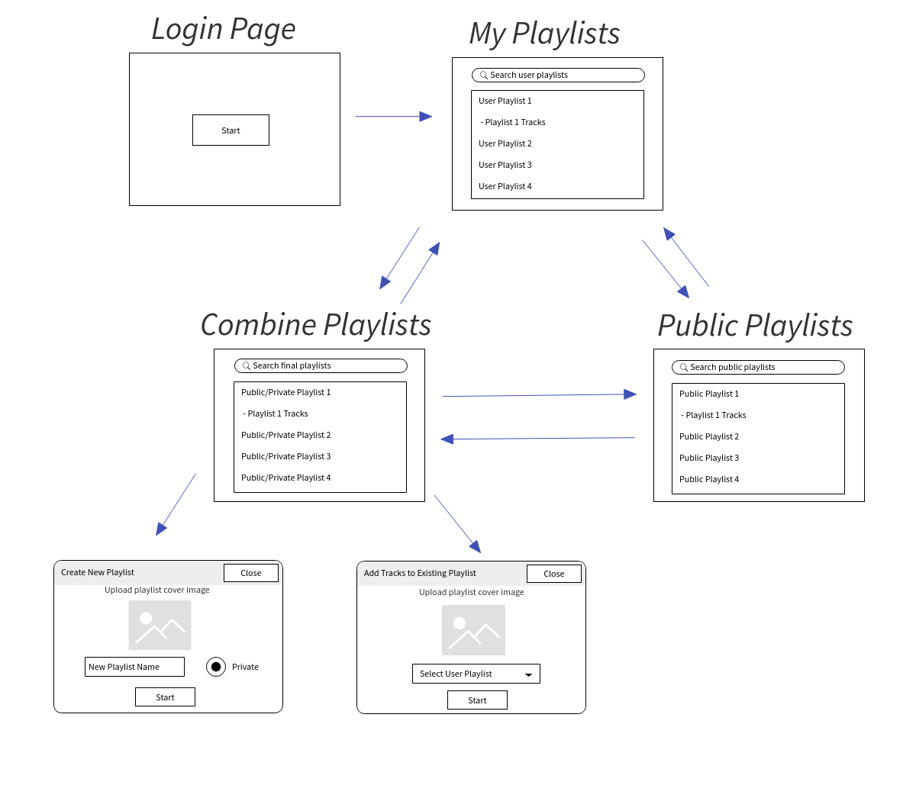

This is the first somewhat serious web application that I wrote in React. It took me a little while to come up with the app name. "Compono" in [Latin means arrange, compile, organize, or compose](https://www.wordsense.eu/compono/) while the ending "fy" is oftentimes attached to applications that use [Spotify Node APIs](http://michaelthelin.se/spotify-web-api-node/) and mixing these together we get [Componofy](https://componofy.herokuapp.com/). The name fits the purpose of the app - help Spotify users combine songs from different playlists and then either create a new playlist, or merge these songs with the existing playlist. It's kind of like combining playlists together, except that it's not necessary to add all songs from a specific playlist.

#### Backend

The backend side of it is written in Node.js using the server framework called [Hapi](https://hapi.dev/). In order to get access to user's personal playlists we have to authenticate the user first. After the user clicks on the button **Start**, the user is redirected to the authorization URL generated by Spotify API method [`createAuthorizeURL`](http://michaelthelin.se/spotify-web-api-node/#createAuthorizeURL). We can control what kind of permissions we want to ask from the user by specifying _scopes_:

```js
const permission_scopes = [
  'playlist-read-private',
  'playlist-read-collaborative',
  'playlist-modify-public',
  'playlist-modify-private',
]
```

Each permission gives the developer access to perform API calls that supply the app with access to Spotify user's data such as personal playlists, making changes to personal playlist like re-ordering its tracks. The following screen then should appear when the user is redirected:


Once the user agrees with the terms to allow developer have access to Spotify data, the user is then redirect back to the base path of the web application. After user authentication completed successfully, we get receive an access token that we use in consequent API calls while the authenticated user is using the app. To keep track of the current user information, the token and some of user info is stored in a session object, which maintains the values of the access token for the session period until the user decides to login. The token is refreshed periodically while the user is actively using the app.

#### Frontend

The frontend side of the application is written in [React](https://reactjs.org/) and utilizes various React packages to achieve crucial goals like routing between pages, dragging and dropping list items to re-order personal playlist tracks, displaying modals, and much more. In addition, I used [Material UI library](https://material-ui.com/).

There is four main views:

- User's playlists
- Public playlists integrated with search
- Final collection of playlists (public and personal) that contain selected songs for final processing
- Fullscreen dialog where the user can:
  - create a new playlist out of the collection with new playlist cover image
  - merge collection of songs with the user's existing playlist

A UI flow that would accurately represent how the user navigates between pages:

